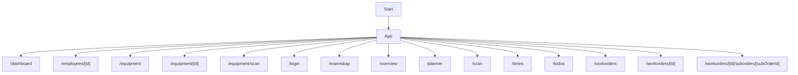

# Genererte routes (auto)

```mermaid
flowchart TD
  A[Start] --> B[App]
  B --> R0["/dashboard"];
  B --> R1["/employees/[id]"];
  B --> R2["/equipment"];
  B --> R3["/equipment/[id]"];
  B --> R4["/equipment/scan"];
  B --> R5["/login"];
  B --> R6["/mannskap"];
  B --> R7["/overview"];
  B --> R8["/planner"];
  B --> R9["/scan"];
  B --> R10["/times"];
  B --> R11["/todos"];
  B --> R12["/workorders"];
  B --> R13["/workorders/[id]"];
  B --> R14["/workorders/[id]/suborders/[subOrderId]"];
```

> Denne fila er auto-generert. Ikke rediger manuelt.